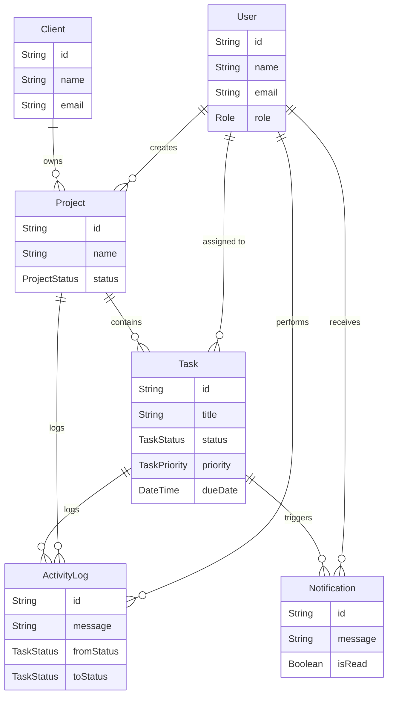

# Velozity Global Solutions - Real-Time Dashboard

A full-stack, real-time client project dashboard built for an internal agency team to manage clients, track task progress, and monitor team activity. 

This project implements strict Role-Based Access Control (RBAC), WebSocket-based live updates, and background chron jobs for overdue task tracking.

---

## 🚀 Tech Stack

### Frontend
- **React 18** (Vite)
- **TypeScript** (Strict mode)
- **Zustand** (State management & Persistence)
- **TanStack React Query** (Data fetching & caching)
- **Socket.io-client** (Real-time updates)
- **Lucide React** (Icons)
- **Vanilla CSS** (Custom dark glassmorphism design system)

### Backend
- **Node.js + Express**
- **TypeScript** (tsx for development)
- **Prisma ORM** (PostgreSQL)
- **Socket.io** (WebSocket server)
- **Zod** (Validation)
- **JWT** (HttpOnly Cookies + Bearer Token Auth)
- **node-cron** (Background workers)

---

## 🔒 Role-Based Access Control (RBAC)

The application enforces strict access controls at both the API and UI levels:

| Role | Permissions | View Access |
|---|---|---|
| **Admin** | Full access to everything | All users, clients, projects, tasks, global live feed, online count |
| **Project Manager** | Manage projects and tasks | Own projects, team tasks, scoped project activity feed |
| **Developer** | Update task status | Only assigned tasks, scoped task activity feed |

---

## 🛠️ Architecture & Design Decisions

### 1. Security First Auth
- **Dual Token System**: Access tokens (15m) are sent via `Authorization: Bearer` headers. Refresh tokens (7d) are securely stored in `HttpOnly` cookies to prevent XSS attacks.
- **Auto-Refresh Interceptor**: The Axios client automatically queues failed requests on `401 Unauthorized`, securely fetches a new access token in the background, and replays the requests without user interruption.

### 2. Real-Time Socket Architecture
- **WebSocket Choice Justification**: I chose **Socket.io** over native WebSockets because it provides critical out-of-the-box features required for a robust production app. Specifically, it offers automatic reconnections (with exponential backoff), built-in room support (crucial for scoping data to PMs/Developers), and fallback HTTP long-polling for environments that block WebSocket upgrades.
- **JWT Handshake**: WebSocket connections are authenticated using the JWT during the initial handshake.
- **Room-Based Scoping**: Emits are scoped by rooms (`feed:global`, `feed:project:id`, `feed:task:id`) based on the user's role to ensure data privacy.
- **Missed-Event Catchup**: On initial connection or reconnect, the client requests missed events from the server to ensure the UI is always in sync, even after network drops.

### 3. Database Indexing Strategy
To ensure the PostgreSQL database remains performant as the activity feed and task lists grow, I implemented strategic compound indexes via Prisma:
- **Tasks (`projectId, status`, `assigneeId, status`, `dueDate, isOverdue`)**: Optimizes the heavy dashboard filtering and overdue cron job queries.
- **ActivityLogs (`projectId, createdAt`, `taskId, createdAt`, `userId, createdAt`)**: Crucial for the real-time feed's initial load and the `feed:catchup` offline-recovery query, ensuring lightning-fast timestamp-based pagination.
- **Notifications (`userId, isRead, createdAt`)**: Instantly resolves the unread notification count query `where: { userId, isRead: false }`.

### 4. Background Jobs (node-cron)
- **Justification**: I chose **node-cron** over a queue like Bull/Redis for the overdue task scheduler. The task is extremely simple—a single bulk `updateMany` Prisma query running every 15 minutes. Introducing Bull would unnecessarily bloat the infrastructure by requiring a Redis instance for something that does not require distributed processing, job retries, or complex concurrency control.

### 5. Custom Design System
- Built a bespoke CSS framework from scratch (`style.css`) using CSS variables.
- Implemented a modern "dark glassmorphism" aesthetic with vibrant gradients, micro-animations, and responsive CSS grid layouts. No component libraries were used.

---

## 📊 Database Schema



---

## ⚠️ Known Limitations

- **Single Instance WebSocket Server**: Currently lacks a Redis adapter for Socket.io, meaning real-time features will only work reliably if the API is deployed as a single instance.
- **Email Notifications**: Currently missing; notifications are strictly in-app.
- **Cron Job Scalability**: The `node-cron` overdue tracker uses a single bulk update. At millions of tasks, this might lock the table and should be replaced with a chunked processing queue (e.g., BullMQ) as the app scales.

---

## 💡 Explanation

The hardest problem I solved was ensuring the **real-time role-filtered feed** accurately reflected each user's permissions without broadcasting sensitive data. I handled this by leveraging Socket.io's built-in room system. Instead of globally broadcasting events and relying the client to filter them (which poses a security risk), the server assigns users to specific rooms upon connecting (`feed:global` for Admins, `feed:project:id` for PMs, and `feed:task:id` for Developers) based on their JWT role. Whenever a task is updated, the backend selectively emits events only to the relevant rooms. To handle potential network drops, I also implemented a `catchup` mechanism where clients send their last known timestamp on reconnection, and the server replays any missed activity logs. If I were to do one thing differently, I would integrate a Redis adapter from the start to allow the WebSocket server to scale horizontally across multiple Node instances seamlessly.

---

## 📦 Setup and Run Instructions

This guide provides step-by-step instructions to setup, seed, run, and stop the Velozity platform locally.

### Prerequisites
- **Node.js** (v18+)
- **npm** (v9+)
- **Docker** & **Docker Compose** (for running the PostgreSQL database)

---

### 1. Local Development Setup (Recommended)

Follow these steps to run the API and Web App locally for development while using Docker exclusively for the PostgreSQL database.

#### Step 1: Install Dependencies
From the root directory of the project, install all dependencies for both the API and Web workspaces:
```bash
npm install
```

#### Step 2: Configure Environment Variables
You need to set up the `.env` file for the API.

**For the API:**
```bash
cp apps/api/.env.example apps/api/.env
```
*(The defaults in `.env.example` will work perfectly with the local Docker database provided. The web app does not require an environment file as it uses a local proxy).*

#### Step 3: Start the Database
Start the PostgreSQL database container in the background using Docker Compose:
```bash
docker compose up -d postgres
```

#### Step 4: Initialize and Seed the Database
Run the Prisma migrations and seed the database with initial Admin, PM, and Developer accounts, along with dummy clients, projects, and tasks.

```bash
# Apply schema to the database
npm run db:migrate

# Generate Prisma Client
npm run db:generate

# Seed the database with default data
npm run db:seed
```

#### Step 5: Start the Development Servers
You can run both the API and the Web frontend in parallel. Open two separate terminal windows/tabs.

**Terminal 1 (Start the Backend API):**
```bash
npm run dev:api
```
*(Runs on `http://localhost:5000`)*

**Terminal 2 (Start the Frontend Web App):**
```bash
npm run dev:web
```
*(Runs on `http://localhost:5173`)*

🎉 The application is now fully running. Navigate to `http://localhost:5173` in your browser.

#### Step 6: Running Tests
The project uses Vitest for unit testing critical sections of both the API and the Web app.

**Run Backend API Tests:**
```bash
npm run test --workspace=apps/api
```

**Run Frontend Web App Tests:**
```bash
npm run test --workspace=apps/web
```

#### Step 7: Stop the Application
To gracefully stop the application:
1. Press `Ctrl + C` in both of your terminal windows running the Web and API servers.
2. Stop the PostgreSQL database container by running:
   ```bash
   docker compose down
   ```

---

### 2. Full Docker Setup (Alternative)

If you prefer to run the entire stack (Database, API, and Frontend) completely inside Docker containers, use this method.

#### Start the Stack
```bash
docker compose up --build -d
```
*(Wait a few seconds for the containers to fully start. The Web UI will be available at `http://localhost:5173`)*

#### Seed the Database (Inside Docker)
Even when running fully inside Docker, you need to migrate and seed the database on your first run:
```bash
docker exec -it velozity_api npm run db:migrate
docker exec -it velozity_api npm run db:seed
```

#### Stop the Stack
To completely shut down and remove the containers:
```bash
docker compose down
```

---

## 🔑 Demo Credentials

If you seeded the database, you can log in immediately with the following test accounts:

- **Admin**: `admin@velozity.dev` / `Admin@1234`
- **PM**: `pm1@velozity.dev` / `Pm1@1234`
- **Developer**: `dev1@velozity.dev` / `Dev1@1234`

*(The frontend login page also features one-click demo logins for convenience).*
